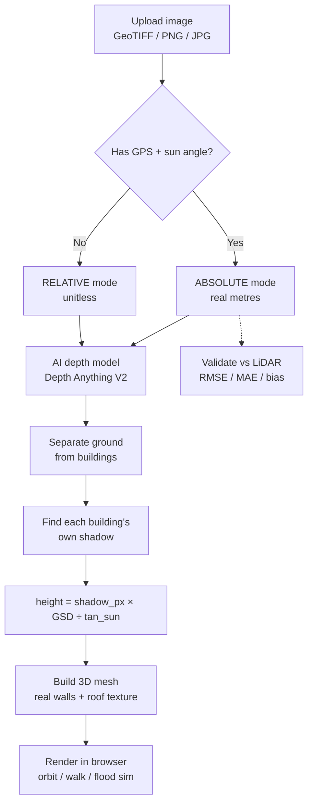

# DepthWizard — Project Documentation

**One-liner:** We turn a single satellite photo into real building heights (in metres) and a walkable 3D city — using shadow physics, not guesswork.

SIH26175 · ISRO / Space Applications Centre · Theme: Disaster Management

---

## 1. What the Problem Statement asks for

> Convert a single flat satellite/aerial RGB image into an elevation map (DSM), and turn that into an interactive 3D scene.

Two input types, two outputs:

| Input | Output |
|---|---|
| Plain photo (PNG/JPG, no location data) | **Relative** heights — "this is taller than that," no units |
| Satellite GeoTIFF (has coordinates + sun angle) | **Absolute** heights — real metres |

**Required building blocks (PS Tier 0):**
1. Read the image, get depth info from a pretrained AI depth model
2. Turn relative depth into real metres (the PS suggests SRTM elevation data or reference points)
3. Build a textured 3D scene you can fly through
4. Let a user upload their own image and see results
5. Show accuracy numbers (RMSE, MAE) against real reference data
6. Package it as one deployable app, not scattered scripts

**How it's graded:** 50% accuracy (RMSE/MAE vs LiDAR, tested across urban/sparse/hilly/forest terrain), 50% visualization quality (navigation, realism, stability, standalone deployment).

---

## 2. What we built ourselves (beyond the PS)

The PS suggests using SRTM (30m resolution satellite elevation data) as a reference to calibrate the AI's depth guess into real metres. **We tried this — it doesn't work.** SRTM is too coarse to see individual buildings, and it correlates with terrain, not rooftops.

**Our method instead — shadow geometry:**

```
height = shadow_length_in_pixels × metres_per_pixel ÷ tan(sun_elevation)
```

Every building's shadow gives us its real height directly, using physics — no AI guessing needed. Sun angle and pixel scale are already in the satellite image's metadata, for free.

**The honesty move that matters most:** we also tried the "obvious" approach — using the AI depth model's raw output, scaled up. We tested it properly (held back some buildings, checked if predictions matched) and got **R² = −0.74**, meaning the AI's guess was *worse than just guessing the average height for every building*. We documented that failure and switched to shadow-only measurement. This is in our README as proof we test our own claims instead of assuming they work.

**Other things nobody asked for that we built anyway:**
- A synthetic test image with known building heights, used as a permanent unit test
- A LiDAR validation pipeline (real USGS government elevation data) to prove our numbers are actually correct, not just self-consistent
- An eave-vs-ridge correction: shadows measure to the roof edge, LiDAR measures to the roof peak — we found this bias (−2.89m) and fixed it with a stated roof-pitch assumption (down to −0.22m)
- Testing across 5 terrain types (urban/suburban/hilly/forest/sparse) with honest reporting of where it fails
- Real vertical building walls (not a smeared height-blob) so first-person walking looks correct
- A working upload website + API, not just command-line scripts

---

## 3. How it works — pipeline flowchart



---

## 4. Repo structure — where everything lives

```
depthwizard/
├── app.py                  ← web server (upload UI + API)
├── pipeline/
│   ├── ingest.py            Step 1: read image, get metadata
│   ├── depth_local.py       Step 2: AI depth model (runs offline, CPU)
│   ├── depth_check.py       Step 3: sanity-check depth direction
│   ├── ground.py            Step 4: separate ground from buildings
│   ├── planb.py             Step 5: measure heights from shadows ⭐
│   ├── validate.py          Step 6: compare against real LiDAR
│   ├── bake.py               Step 7: package for the 3D viewer
│   ├── export.py             Extra: GeoTIFF / OBJ / CSV export
│   └── stratify.py           Extra: multi-terrain comparison report
├── viewer/
│   ├── index.html            The 3D scene (orbit, walk, flood sim)
│   └── upload.html           Drag-and-drop upload page
├── scripts/
│   ├── fetch_maxar.py        Download real satellite disaster imagery
│   └── make_sample.py        Generate the synthetic test scene
├── data/raw/                 Source satellite images
├── data/work/<scene>/        Per-scene intermediate results
├── viewer/data/<scene>/      Baked 3D-viewer-ready files
├── docs/stratification.md    5-terrain accuracy comparison
└── README.md                 Full technical writeup + results
```

---

## 5. Status — what's built vs what's left

| # | PS requirement | Status |
|---|---|---|
| 1 | Read image + metadata | ✅ Done |
| 2 | AI depth extraction | ✅ Done (runs offline, CPU) |
| 3 | Relative → absolute calibration | ✅ Done (shadow geometry, better than PS's suggested SRTM route) |
| 4 | 3D textured scene | ✅ Done, with real walls (not smeared blobs) |
| 5 | First-person navigation | ✅ Done (Orbit / Walk toggle, WASD) |
| 6 | User upload + visualize | ✅ Done (drag-and-drop web app) |
| 7 | Accuracy vs reference data | ✅ Done (real USGS LiDAR, RMSE 3.66m) |
| 8 | Stability across 4 terrain types | ✅ Done (5 scenes tested, honestly reported) |
| 9 | Standard geospatial export | ✅ Done (GeoTIFF, OBJ, CSV) |
| 10 | **Standalone offline deployment (Docker)** | ⬜ **Not started — next priority** |
| 11 | Edge-aware depth refinement | ⬜ Not started |
| 12 | Vegetation/terrain false-positive filtering | ⬜ Not started (documented limitation) |
| 13 | Second LiDAR-validated scene | ⬜ Not started (only 1 of 5 scenes has ground truth) |
| 14 | Semantic building segmentation | ⬜ Not started (would fix rooftop over-splitting) |

**Bottom line: all required Round-1 deliverables are built and working. Remaining work is hardening for the December finale.**

---

## 6. Key results (so far)

| Scene | Terrain | Buildings found | Measured | Accuracy vs LiDAR |
|---|---|---|---|---|
| Antakya, Türkiye | Dense urban | 167 | 125 (75%) | — (no local LiDAR) |
| Fort Myers, USA | Suburban | 150 | 106 (71%) | **RMSE 3.66m** ✅ |
| Atlas Mountains | Hilly | 50 | 18 (36%) | — |
| Ian Forest | Forested | 304* | 48 (16%) | — |
| Ian2 | Sparse/barren | 110* | 1 (1%) | — |

*Forest/barren counts include known false positives (tree crowns, rocks) — documented, not hidden.

---

## 7. How to run it

```bash
# one-time setup
pip install --index-url https://download.pytorch.org/whl/cpu torch torchvision
pip install -r requirements.txt
pip install fastapi "uvicorn[standard]" python-multipart

# run the web app
uvicorn app:app --host 0.0.0.0 --port 8000
# open http://localhost:8000 — drag in a GeoTIFF/PNG/JPG

# OR just view the pre-built scenes, no processing:
python -m http.server 8000
# open http://localhost:8000/viewer/?scene=antakya
```

Full command-by-command pipeline instructions (re-running from scratch, LiDAR validation, adding new scenes) are in `README.md`.

**⚠️ Important:** pipeline stages read from disk and don't check if earlier steps are stale. Always run them in order (ingest → depth → check → ground → planb → validate → bake) or you'll get plausible-looking wrong numbers.

---

## 8. Honest limitations (say these before a judge asks)

- **Depth model was tested and rejected** as the height source (R² = −0.74) — shadows do the real measurement now
- **Only Fort Myers has real LiDAR ground truth** — other scenes report internal consistency ("repeatability"), not verified accuracy
- **Forest and barren terrain produce false-positive "buildings"** — tree crowns and rocks cast shadows too; the system has no semantic understanding of *what* cast a shadow yet
- **Short/tiny buildings are harder to measure** — a 3m building's shadow is only ~10 pixels; resolution matters
- **Dense rooftops sometimes over-split** into narrow strips (visible in walk mode from above) — needs real segmentation, not just a height threshold

---

## 9. What's next (priority order, post-Round-1)

1. **Docker packaging** — full offline deployment, verified with networking disabled (named PS requirement)
2. **Vegetation false-positive filter** — cheap fix, reuses existing greenness-detection code
3. **Edge-aware depth refinement** — sharper building outlines, fixes the "fin" over-splitting
4. **Second LiDAR-validated scene** — strengthen the accuracy claim beyond one scene
5. **Semantic building segmentation** — the real, harder fix for rooftop over-splitting and terrain/vegetation false positives

---

*For full technical detail, exact numbers, and the complete build history, see `README.md` and `docs/stratification.md` in the repo.*
